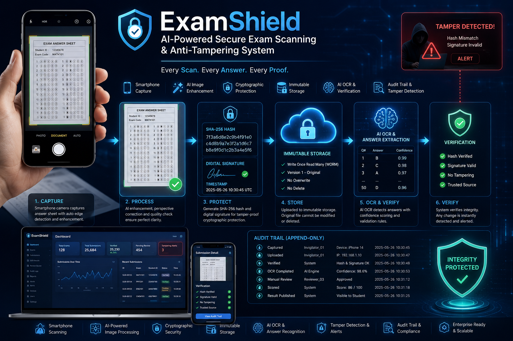

<div align="center">



# ExamShield

**AI-powered secure exam scanning & anti-tampering system**

[](LICENSE)
[](https://github.com/your-org/examshield/actions)
[](https://dotnet.microsoft.com)
[](https://flutter.dev)
[](https://react.dev)
[](infra/docker-compose.yml)
[](CONTRIBUTING.md)

[Features](#features) · [Architecture](#architecture) · [Quick Start](#quick-start) · [API](#api) · [Roadmap](#roadmap) · [Contributing](#contributing) · [License](#license)

</div>

---

## What Is ExamShield?

ExamShield replaces the traditional flatbed scanner with a smartphone camera. The moment an invigilator photographs a paper answer sheet, the image is **hashed, digitally signed, and stored immutably**. No administrator — not even a super-admin — can alter the image without breaking the cryptographic chain of custody.

An OCR pipeline then reads every bubble. Low-confidence results route to a human review queue. Every action is recorded in an **append-only audit log**.

> Designed for national-scale examinations: 100,000+ answer sheets, concurrent uploads, offline-first capture.

---

## Features

### Community Edition (this repo — MIT / Apache 2.0)

| Feature | Status |
|---|---|
| Smartphone Capture (Flutter) | ✅ |
| Edge Detection & Perspective Correction | ✅ |
| SHA-256 Hash Generation (on-device) | ✅ |
| ECDSA / Ed25519 Digital Signature | ✅ |
| Bubble Detection & OCR Pipeline | ✅ |
| Immutable Object Storage (MinIO / S3 Object Lock) | ✅ |
| Append-only Audit Log | ✅ |
| REST API (ASP.NET Core 9) | ✅ |
| Basic Admin Dashboard (React) | ✅ |
| Docker Compose dev stack | ✅ |
| RBAC (15 roles, Zero Trust) | ✅ |
| Unit & Integration Tests | ✅ |

---

## Demo

> Screenshots and GIF walkthroughs live in [docs/screenshots/](docs/screenshots/).

| Capture Flow | Security Dashboard | Audit Timeline |
|---|---|---|
| *(coming soon)* | *(coming soon)* | *(coming soon)* |

To record your own demo after running locally:

```bash
# macOS: use QuickTime → File → New Screen Recording
# Linux: use OBS or peek (GIF recorder)
```

---

## Architecture

```
┌────────────────────────────────────────────────────────────────────┐
│                        ExamShield System                           │
│                                                                    │
│  ┌─────────────┐    ┌──────────────────────────────────────────┐  │
│  │ Flutter App │    │             ASP.NET Core 9 API           │  │
│  │  (Mobile)   │───▶│  ┌──────────┐  ┌──────────┐             │  │
│  │             │    │  │ Commands │  │ Queries  │  (CQRS)     │  │
│  │ • Capture   │    │  │(MediatR) │  │(MediatR) │             │  │
│  │ • Hash      │    │  └────┬─────┘  └─────┬────┘             │  │
│  │ • Sign      │    │       │               │                  │  │
│  │ • Upload    │    │  ┌────▼───────────────▼────┐             │  │
│  └─────────────┘    │  │      Domain Layer       │             │  │
│                     │  │  (Entities, Value Objs, │             │  │
│  ┌─────────────┐    │  │   Domain Events)        │             │  │
│  │  React      │    │  └────────────┬────────────┘             │  │
│  │  Dashboard  │───▶│               │                          │  │
│  │             │    │  ┌────────────▼────────────┐             │  │
│  │ • Monitor   │    │  │   Infrastructure Layer  │             │  │
│  │ • Review    │    │  │                         │             │  │
│  │ • Audit     │    │  │ EF Core │ MinIO │ Redis  │             │  │
│  └─────────────┘    │  │ RabbitMQ │ Tesseract    │             │  │
│                     │  └─────────────────────────┘             │  │
│                     └──────────────────────────────────────────┘  │
│                                                                    │
│  ┌──────────┐  ┌──────────┐  ┌──────────┐  ┌──────────────────┐  │
│  │PostgreSQL│  │  Redis   │  │ RabbitMQ │  │ MinIO / S3 Lock  │  │
│  └──────────┘  └──────────┘  └──────────┘  └──────────────────┘  │
└────────────────────────────────────────────────────────────────────┘
```

### Capture Pipeline (sequence)

```
Invigilator App          API Server              Storage
      │                      │                      │
      │─── POST /capture ───▶│                      │
      │    {hash, signature} │                      │
      │                      │── verify signature ──│
      │◀── 201 captureId ────│                      │
      │                      │                      │
      │─── POST /upload ────▶│                      │
      │    {image bytes}     │── re-hash bytes      │
      │                      │── compare hash ──────│
      │                      │── write immutable ──▶│
      │                      │── append audit log   │
      │◀── 200 verified ─────│                      │
```

### Clean Architecture layers

```
ExamShield/
├── src/
│   ├── ExamShield.Domain/          # Entities, value objects, domain events
│   ├── ExamShield.Application/     # CQRS commands/queries (MediatR)
│   ├── ExamShield.Infrastructure/  # EF Core, MinIO, OCR, crypto, messaging
│   ├── ExamShield.Api/             # ASP.NET Core 9 endpoints, OpenAPI
│   ├── ExamShield.Mobile/          # Flutter (Android + iOS)
│   └── ExamShield.Dashboard/       # React + TypeScript + Tailwind + shadcn/ui
├── tests/
│   ├── ExamShield.UnitTests/
│   └── ExamShield.IntegrationTests/
└── infra/
    ├── docker-compose.yml
    └── k8s/                        # Kubernetes manifests
```

---

## Quick Start

### Prerequisites

- [Docker Desktop](https://www.docker.com/products/docker-desktop/) ≥ 24
- [.NET 9 SDK](https://dotnet.microsoft.com/download/dotnet/9.0)
- [Flutter 3.x](https://docs.flutter.dev/get-started/install) (for mobile)
- [Node.js 20+](https://nodejs.org/) (for dashboard)

### 1 — Spin up infrastructure

```bash
git clone https://github.com/your-org/examshield.git
cd examshield
docker compose -f infra/docker-compose.yml up -d
```

This starts **PostgreSQL**, **Redis**, **RabbitMQ**, and **MinIO**.

### 2 — Backend API

```bash
dotnet restore
dotnet build
dotnet test
dotnet run --project src/ExamShield.Api
```

API is available at `https://localhost:5001`. OpenAPI UI at `https://localhost:5001/swagger`.

### 3 — Admin Dashboard

```bash
cd src/ExamShield.Dashboard
npm install
npm run dev
```

Dashboard at `http://localhost:5173`.

### 4 — Mobile App (Flutter)

```bash
cd src/ExamShield.Mobile
flutter pub get
flutter run           # connects to localhost API by default
```

### Environment variables

Copy and edit the example:

```bash
cp infra/.env.example infra/.env
```

Key variables:

| Variable | Description |
|---|---|
| `POSTGRES_CONNECTION` | PostgreSQL connection string |
| `REDIS_CONNECTION` | Redis connection string |
| `MINIO_ENDPOINT` | MinIO / S3 endpoint |
| `JWT_SIGNING_KEY` | ECDSA P-256 private key (PEM) |
| `ALERT_EMAIL_SMTP` | SMTP host for email alerts |

---

## API

Full OpenAPI spec is served at `/swagger` when running locally.

### Core endpoints

```http
POST   /capture              Register a new capture (hash + signature)
POST   /upload               Upload image bytes
GET    /verify/{id}          Re-verify hash and signature
GET    /audit                Query append-only audit log
POST   /ocr                  Trigger OCR pipeline
POST   /score                Finalize scoring
GET    /results              Published results
GET    /statistics           Dashboard statistics
```

### Auth

```http
POST   /auth/login           JWT login
POST   /auth/refresh         Refresh token
POST   /auth/logout          Revoke session
POST   /auth/mfa/verify      MFA code verification
```

### Device management

```http
POST   /devices/register     Register a trusted capture device
PUT    /devices/{id}         Approve / disable device
```

### Public verification (anonymous)

```http
GET    /public/verify?hash=  Verify SHA-256 hash without login
```

---

## Security

Security is a first-class concern in ExamShield.

- SHA-256 image hash computed **on-device** before any network call
- Server **re-verifies** hash on receipt; mismatches are rejected and alerted
- ECDSA P-256 / Ed25519 device signing keys; public keys registered server-side
- Invisible forensic watermark embedded in every stored image
- Append-only audit log — no UPDATE or DELETE path exists in the schema
- Zero Trust RBAC with 15 roles and hard Separation-of-Duties constraints
- Alert triggers: hash mismatch, duplicate upload, suspicious login, invalid signature

To report a vulnerability, see [SECURITY.md](SECURITY.md).

---

## Roadmap

See [ROADMAP.md](ROADMAP.md) for the full versioned plan.

| Version | Theme | Target |
|---|---|---|
| v0.1 | Core pipeline (capture → verify → audit) | Q3 2026 |
| v0.2 | OCR + manual review queue | Q3 2026 |
| v0.3 | Scoring engine + result publication | Q4 2026 |
| v0.4 | Full RBAC + MFA | Q4 2026 |
| v1.0 | Production-ready + Kubernetes | Q1 2027 |

---

## Contributing

We welcome contributions of all sizes. Please read [CONTRIBUTING.md](CONTRIBUTING.md) before opening a PR.

Quick summary:
1. Fork → branch (`feat/your-feature` or `fix/your-bug`)
2. Write a failing test first (TDD)
3. Implement the change
4. `dotnet test` — all green
5. Open a PR against `main`

---

## Community

- **GitHub Issues** — bug reports and feature requests
- **GitHub Discussions** — questions, ideas, show-and-tell
- **Security disclosures** — see [SECURITY.md](SECURITY.md)

---

## License

ExamShield Community Edition is dual-licensed under **[MIT](LICENSE)** and **[Apache 2.0](LICENSE)**. You may choose either license.

See [LICENSE](LICENSE) for full terms.

---

<div align="center">
Built with care for integrity in education.
</div>
