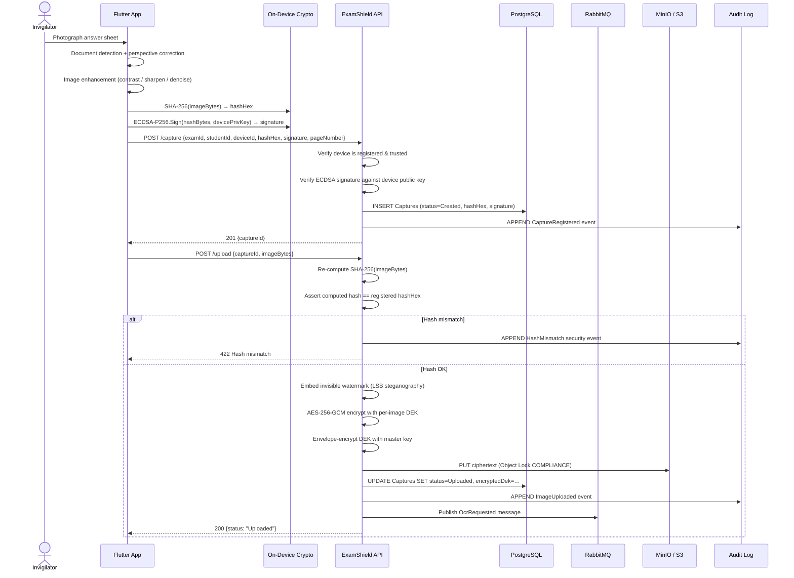
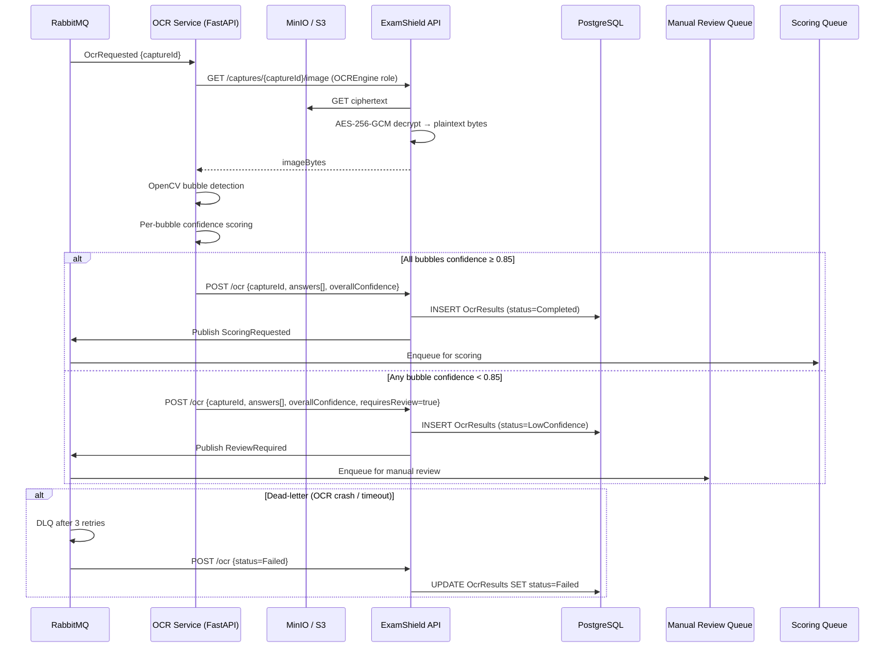
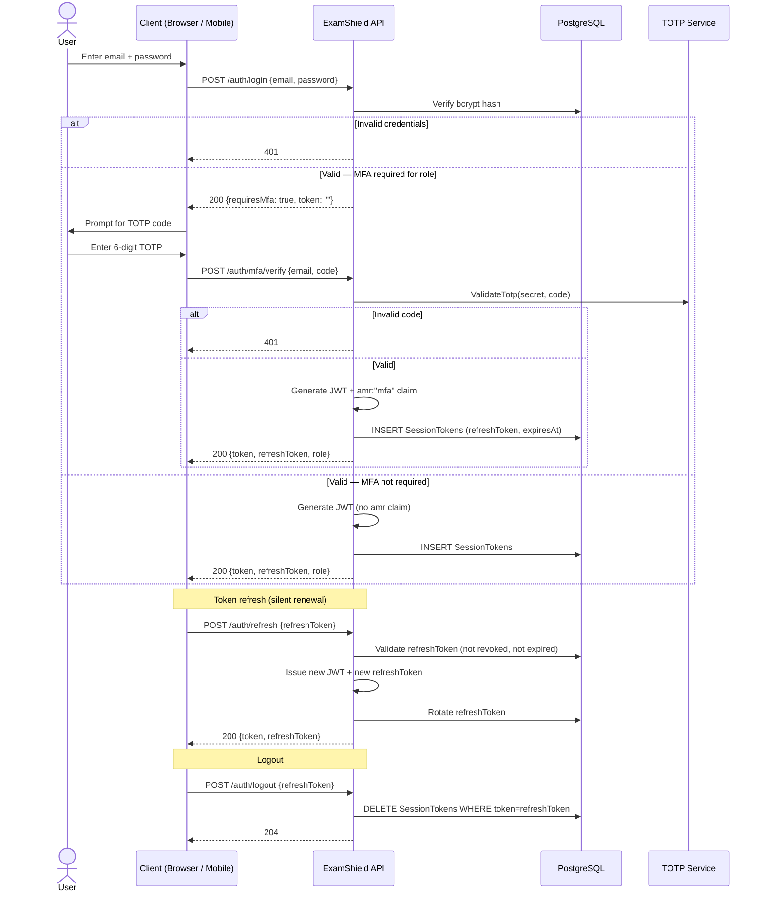
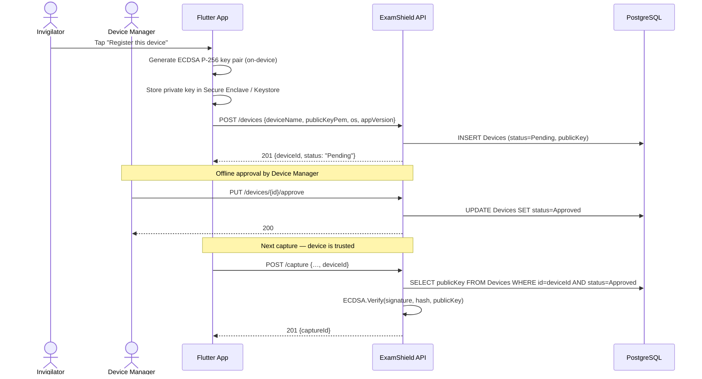
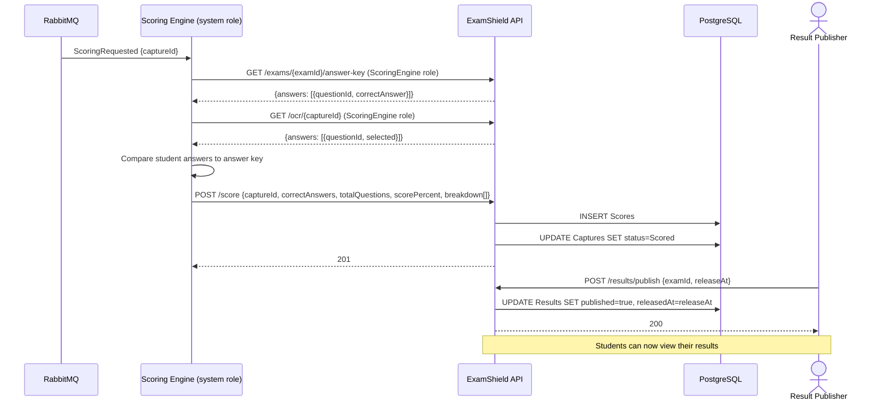

# ExamShield — Sequence Diagrams

All diagrams use [Mermaid](https://mermaid.js.org/) syntax and render natively in GitHub.

---

## 1. Capture & Upload Flow

The end-to-end journey from photograph to immutably stored image.



---

## 2. OCR Pipeline

Automated answer extraction with confidence-gated human fallback.



---

## 3. Manual Review Flow

A human reviewer inspects the original image and records an interpretation. No pixel modification is possible.

```mermaid
sequenceDiagram
    actor Rev as Manual Reviewer
    actor Sup as Review Supervisor
    participant API as ExamShield API
    participant S3 as MinIO / S3
    participant DB as PostgreSQL
    participant AL as Audit Log

    Rev->>API: GET /reviews/pending
    API-->>Rev: [{reviewId, captureId, ocrPredictions[]}]

    Rev->>API: GET /captures/{id}/image (ManualReviewer role)
    API->>S3: GET ciphertext
    API->>API: Decrypt → plaintext bytes
    API-->>Rev: imageBytes (read-only; no write path exists)

    Rev->>API: POST /reviews/{id}/submit {interpretedAnswers[]}
    API->>DB: INSERT ReviewDecision (immutable)
    API->>AL: APPEND ReviewSubmitted event (signed)
    API-->>Rev: 200

    Sup->>API: POST /reviews/{id}/approve
    API->>DB: UPDATE ManualReviews SET status=Approved
    API->>AL: APPEND ReviewApproved event
    API->>API: Publish ScoringRequested
    API-->>Sup: 200

    alt Supervisor rejects
        Sup->>API: POST /reviews/{id}/reject {reason}
        API->>DB: UPDATE ManualReviews SET status=Rejected
        API->>AL: APPEND ReviewRejected event
        API-->>Sup: 200
    end

    alt Supervisor escalates
        Sup->>API: POST /reviews/{id}/escalate
        API->>DB: SET status=Escalated
        API->>AL: APPEND Escalated event
    end
```

---

## 4. Authentication & MFA Flow

JWT issuance with TOTP step-up for privileged roles.



---

## 5. Device Registration Flow

New device onboarding with cryptographic key binding.



---

## 6. Public Verification Flow

Anonymous third-party verification of a capture's authenticity.

```mermaid
sequenceDiagram
    actor Public as Verifier (Anonymous)
    participant UI as Public Verification Page
    participant API as ExamShield API
    participant DB as PostgreSQL
    participant S3 as MinIO / S3

    Public->>UI: Scan QR code or enter capture ID / SHA-256 hash
    UI->>API: GET /public/verify?captureId=…  (no auth required)
    API->>DB: SELECT hashHex, signature, deviceId, status, capturedAt FROM Captures
    alt Capture not found
        API-->>UI: 404
    else Found
        API->>DB: SELECT publicKey FROM Devices WHERE id=deviceId
        API->>API: ECDSA.Verify(signature, hashHex, publicKey)
        API->>S3: GET ciphertext (internal)
        API->>API: Decrypt → plaintext bytes
        API->>API: SHA-256(plaintext) → recomputedHash
        API->>API: Assert recomputedHash == storedHashHex
        API->>API: Extract watermark → verify captureId + nonce match
        API-->>UI: {
            captureId, examId, studentId,
            hashVerified: true,
            signatureVerified: true,
            watermarkIntact: true,
            capturedAt, uploadedAt,
            chainOfCustodyUrl
        }
        UI-->>Public: ✅ Authentic — Hash, Signature, Watermark all verified
    end
```

---

## 7. Scoring & Result Publication Flow


